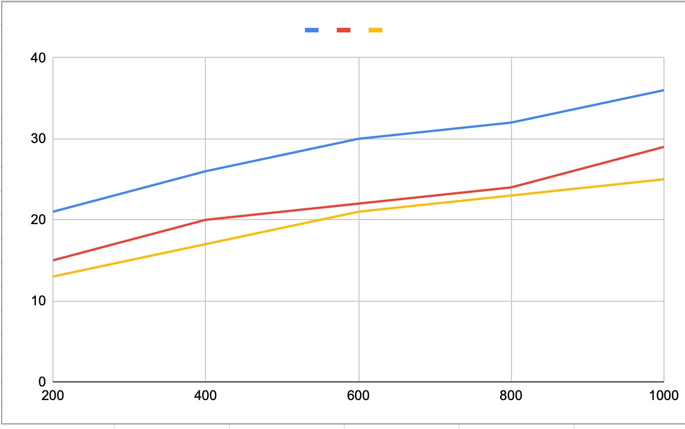
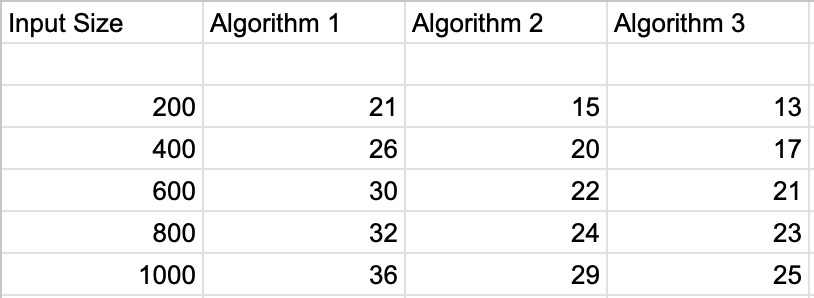
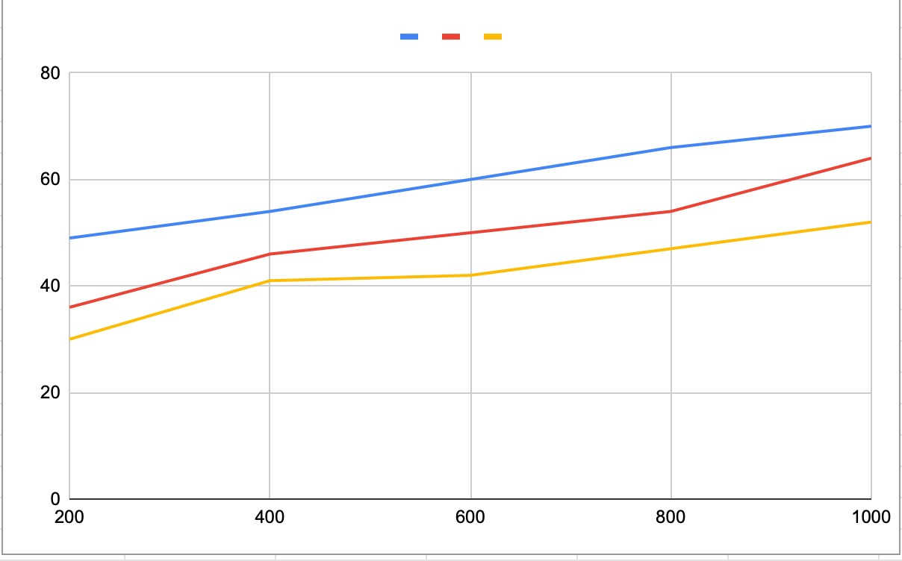
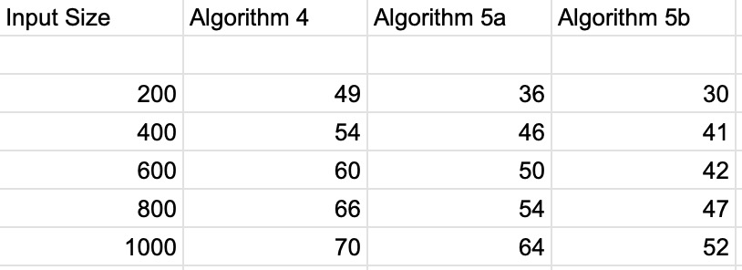
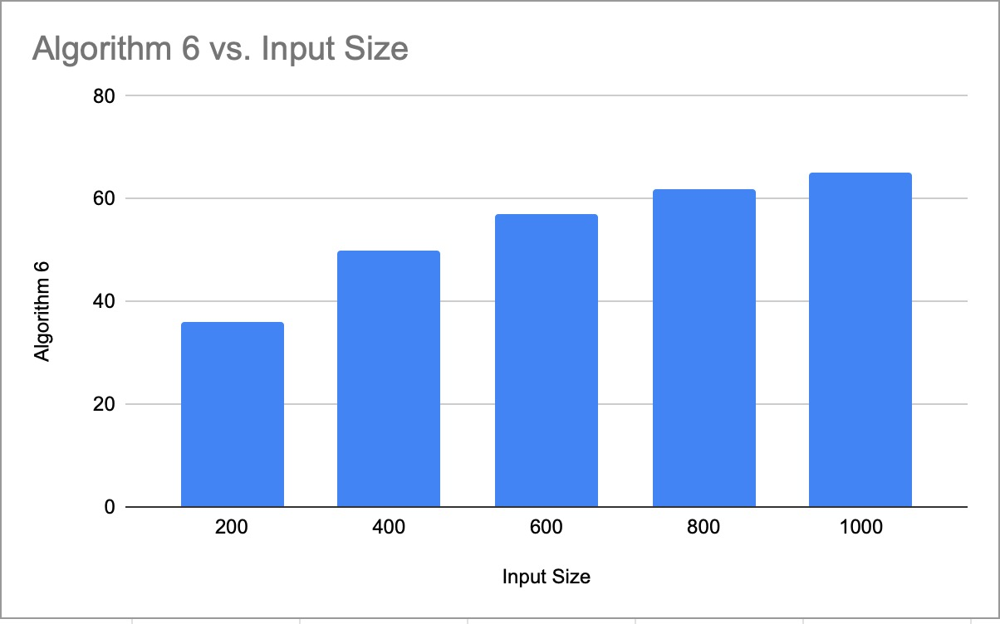
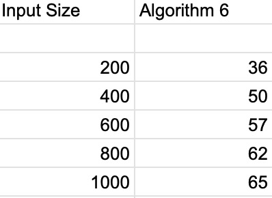

#  Dynamic-Programming-Project <br>

### COT5405 Analysis of Algorithm (AOA)

### Team Members Contribution
#### <i> Lohit Bhambri (lohit.bhambri@ufl.edu) </i>
1. Implemented Algorithm 1
2. Implemented Algorithm 3
3. Implemented Algorithm 5
4. Implemented Algorithm 6
5. Report Compilation
6. Analysis of Algorithms (equal contributor)

#### <i> Sharath Bhushan Podila (spodila@ufl.edu) </i>
1. Implemented Algorithm 2
2. Implemented Algorithm 4
3. Implemented MakeFile mechanism and execution in Remote CISE Machines
4. Experimental Comparative Strategy mechanism result generation
5. Analysis of Algorithms (equal contributor)

### Problem 1:
****
#### <i>Algorithm 1:</i>
```aidl
The given code represents a method named getSolution that takes three integer parameters m, n, and h. The method aims to
find the largest rectangular area that can be formed with the minimum height h and the plot data represented in a 2D 
array called plot.

The method first uses two nested for loops to traverse the plot array row-wise and column-wise. For each plot cell that 
has a height greater than or equal to h, it sets the upper bound and lower bound of a rectangle with the current plot 
cell as the top-left corner.

Next, it calls a helper function with the current plot cell's position and the plot array's dimensions. The helper 
function returns the position of the cell with a height less than h that is immediately below and to the right of the 
current plot cell. The lower bound of the rectangle is updated to the position of this cell if it is farther from the 
current plot cell than the current lower bound.

The method calculates the area of the rectangle bounded by the upper and lower bounds and updates the global maximum 
area and its corresponding upper and lower bounds if the local area is greater than the global area.

Finally, the method returns a string representation of the global maximum area's upper and lower bounds. It also prints 
the same information to the console.
```

<u><i>Time Complexity:</i></u><br>
The time complexity of algorithm is O(m<sup>3</sup> n<sup>3</sup>).<br>
We are visiting every cell and at every cell we are checking the possibility of better square by going top and left <br>
of the bottom corner respectively conditionally.

#### <i>Algorithm 2:</i>
```aidl
The code implements two functions that are part of a program that analyzes a matrix of plotMat of size mxn representing 
the heights of the ground.
The first function, checkBoundary(), receives as input the matrix plotMat, the coordinates of a cell in the matrix 
(i, j), the size of the matrix (m, n), and a threshold height value (h). It returns an array of three integers.
This function checks if the cells in the matrix from the cell (i, j) to the bottom-right diagonal cells of the matrix 
form a square with all its cells having a height value greater than or equal to the threshold value h. It does this 
by incrementing a counter, count, that tracks the size of the square. The function starts at (i,j) and extends the 
square diagonally as long as all the cells in the current row and column being considered have a height value greater 
than or equal to the threshold value. Once a cell is found that does not meet this condition, the function updates the 
right corner coordinates of the square and exits the loop. Finally, the function returns an array containing the 
coordinates of the top-left corner of the square (i,j) and the size of the square (count).
The second function, getMaxPossibleBoundary(), receives as input the matrix plotMat and the threshold value h. 
It initializes variables to keep track of the maximum square size found (currentMax) and the coordinates of the top-left
and bottom-right corners of the largest square found (currentLeftCorner and currentRightCorner). It then iterates 
through all cells of the matrix and for each cell (i,j) that has a height value greater than or equal to the threshold 
value h, it calls the checkBoundary() function passing the cell coordinates and other parameters as arguments. If the
resulting square size is greater than the currentMax size, it updates the currentMax size and the corner coordinates
variables. After all cells have been checked, the function returns an array containing the currentMax size and the 
coordinates of the top-left and bottom-right corners of the largest square found.
```
<u><i>Time Complexity:</i></u><br>
The time complexity for the algorithm is O(m<sup>2</sup> n<sup>2</sup>)

#### <i>Algorithm 3:</i>
```aidl
The problem involves finding the largest square area in a given 2D grid where all the elements of the square are greater
than or equal to a given height 'h'. The solution involves using 2D memorization to compute the solution efficiently.

Here's the algorithmic explanation of the provided pseudocode:
Define a method named "getSolution" that takes in three integer parameters 'm', 'n', and 'h' representing the dimensions
of the 2D grid and the minimum height required for the square area.

Initialize a 2D string array 'memorization2D' of size 'm' x 'n'. This array will be used to store the solution of the 
subproblems that are computed using 2D memorization.

Fill up the last row of the 'memorization2D' array by iterating through each column 'c' of the last row. If the value of
the corresponding element in the original 2D grid is greater than or equal to 'h', set the value of 
'memorization2D[m-1][c]' to the string representation of the row and column indices of the element in the 
format 'row,column'. Otherwise, set the value of 'memorization2D[m-1][c]' to "-1,-1".

Fill up the last column of the 'memorization2D' array by iterating through each row 'r' of the last column. 
If the value of the corresponding element in the original 2D grid is greater than or equal to 'h', set the value of 
'memorization2D[r][n-1]' to the string representation of the row and column indices of the element in the format 
'row,column'. Otherwise, set the value of 'memorization2D[r][n-1]' to "-1,-1".

Compute the solution of the subproblems using 2D memorization. Iterate through each row 'r' of the 'memorization2D' 
array from the second last row to the first row, and within each row, iterate through each column 'c' from the second 
last column to the first column. If the value of the corresponding element in the original 2D grid is greater than or 
equal to 'h', compute the solution of the subproblem for the current position by checking the three adjacent positions 
to the right, bottom, and bottom-right. If any of these adjacent positions has a value of "-1,-1", set the current 
position's value to "-1,-1", indicating that it's not possible to form a square of size 'h' at this position. 
Otherwise, set the current position's value to the same value as the bottom-right adjacent position's value, indicating 
that a square of size 'h' can be formed at this position. Also, check if the current position and the bottom-right 
adjacent position form a larger square by checking the values of the 'global_x_u', 'global_y_u', 'global_x_b', and 
'global_y_b' variables. If they do, update the values of these variables.

Finally, return the string representation of the 'global_x_u', 'global_y_u', 'global_x_b', and 'global_y_b' variables 
as the solution to the problem.
```

<u><i>Time Complexity:</i></u>

The time complexity for this algorithm is O(mn).<br>
Here we are performing bottom-up dynamic programming and using 2D memorization.

<u><i> Analysis of Algorithm:</i></u><br>

memorization2D(r,c) = bottom-right corner/coordinate value<br>
goal = (global_x_u,global_y_u) and (global_x_b,global_y_b) <br>

<i>Bellman-Equation:</i>
```aidl
memorization2D[r][c] will be 

a. (r,c):
        if (r = m-1 && 0<=c<n and plot[r][c]>= h) OR (c = n-1 && 0<=r<m and plot[r][c]< h)
b. -1,-1:
        if(r = m-1 && 0<=c<n and plot[r][c]< h) OR (c = n-1 && 0<=r<m and plot[r][c]< h) OR
        (memorization2D[r+1][c] OR memorization2D[r+1][c+1] OR memorization2D[r][c+1] == -1,-1)
c. memorization2D[r][c]:
         (memorization2D[r+1][c] AND memorization2D[r+1][c+1] AND memorization2D[r][c+1] != -1,-1)
```


### Problem 2:
****
#### <i>Algorithm 4:</i>
```aidl
Here the getSolution Java function that takes four parameters: m, n, h, and mat.

m and n are integers representing the dimensions of the matrix mat.
h is an integer representing the minimum height required for a cell to be included in a square.
mat is a 2D array of integers representing the matrix.
The function returns a string with four space-separated integers representing the coordinates of the bottom-right corner
of the largest square that can be formed with cells having height greater than or equal to h.

Here's what the function does:

It sets the mat and columns instance variables of the class to the passed-in mat and a new m x n array of integers, 
respectively.
It calls the setColumnsMatrix method of the class to set the values of the columns array.
It initializes a new m x n array of integers named sqr and calls the setSquareMatrix method to set its values.
It initializes maxLen to 2 and bottomRighti and bottomRightj to 1.
It loops through the cells of the matrix starting from the second row and second column (i.e., row index 2 and column 
index 2).
For each cell, it checks the height of cells in the same column to its left and to the bottom row to see if they are at 
least h high. It determines the maximum square size that can be formed using these heights and sets the variable 
sideLength to the smaller of that value and the value in the columns array at the previous row in the same column. 
It also sets squareSize to the value in the sqr array at the previous row and column.
It calculates the maximum possible side length of a square that can be formed using the current cell as the bottom-right
corner. It does this by checking the heights of cells in the same row to the left and in the same column above the 
square. If these cells are at least h high and the previous row and column contain a square of at least the same size, 
it sets maxSide to squareSize + 2. Otherwise, it sets maxSide to squareSize + 1.

If maxSide is greater than maxLen, it sets maxLen to maxSide and updates the values of bottomRighti and bottomRightj to 
the current row and column, respectively.
After the loop completes, it constructs a string with the coordinates of the bottom-right corner of the largest square 
found and returns it.
```

<u><i>Time Complexity:</i></u><br>
The time complexity for this algorithm is O(mn). Here we are memorizing the best possible square by setting up the
square matrix.<br>We are computing the 'sqr' matrix using following function:<br>
```aidl
this.sqr[r][c] = 1+Math.min(top,left,topLeft);
```
Where r,c is the current row & column index.<br>
We take minimal of three direction:
1. top
2. left
3. top-left<br>
and add 1 to compute the best possible square at that index.<br>

#### <i>Algorithm 5:(A & B)</i>
```aidl
Algorithm 5a is the recursive representation and Algorithm 5b is the iterative representation of the code but 
fundamentals of the logic remains unchanged.

The algorithm takes three integer inputs, m, n, and h, representing the dimensions of a plot of land (m x n) and a 
minimum height h that needs to be maintained. It returns a string representing the coordinates of the largest possible 
square plot of land within the given plot that meets the minimum height requirement.

The function first creates a boolean matrix called memorizationBoolean, where each element is 1 if the corresponding 
element in the original plot matrix is greater than or equal to h, and 0 otherwise. It then creates three additional 
matrices: memorizationLeft, memorizationTopLeft, and memorizationTop, each representing the maximum length of a square 
that can be formed by extending to the left, top-left, or top of each element in the memorizationBoolean matrix, 
respectively. Finally, it creates a matrix called memorizationFinal that represents the largest possible rectangular 
plot of land with a minimum height of h that can be formed with each element in the memorizationBoolean matrix as its 
bottom-right corner.

The function calculates the values in the memorizationLeft, memorizationTopLeft, and memorizationTop matrices using 
dynamic programming, and then calculates the values in the memorizationFinal matrix using the values in the other three 
matrices. It then finds the largest value in the memorizationFinal matrix, which represents the size of the largest 
possible rectangular plot of land with a minimum height of h, and returns the coordinates of this plot as a string.

The string is formatted as four integers separated by spaces: the x and y coordinates of the upper-left corner of the 
plot and the x and y coordinates of the lower-right corner of the plot. Note that the coordinates are 1-indexed, so 
the first row and column have index 1, not 0.
```

<u><i>Time Complexity:</i></u>

The time complexity for this algorithm is O(mn).<br>
Here we are performing bottom-up dynamic programming and using 2D memorization.

<u><i> Analysis of Algorithm:</i></u><br>

Here we will memorize the three matrices mentioned below based upon the formula:<br>
```aidl
memorizationLeft[r][c] = 1+Math.min(Math.min(memorizationLeft[r-1][c-1],memorizationLeft[r-1][c]),
                                                            Math.max(1,memorizationLeft[r][c-1]));
                                                            
memorizationTopLeft[r][c] = 1+Math.min(Math.min(memorizationTopLeft[r-1][c],memorizationTopLeft[r][c-1]),
                                                            Math.max(1,memorizationTopLeft[r-1][c-1]));
                                                            
memorizationTop[r][c] = 1+Math.min(Math.min(memorizationTop[r-1][c-1],memorizationTop[r][c-1]),
                                                            Math.max(1,memorizationTop[r-1][c]));
```

memorizationFinal(r,c) = memorized best square area at given [r][c] cell
goal = (global_x_u,global_y_u) and (global_x_b,global_y_b) <br>

<i>Bellman-Equation:</i>
```aidl
memorization2D[r][c] will be 

a. 0,1 and 1,0:
    memorizationFinal[r][c] = 1;
b. 0,2 and 2,0:
    memorizationFinal[r][c] = 2;
c. r,c:
      memorizationFinal[r][c] = 1+Math.min(Math.min(memorizationLeft[r][c-1],memorizationTopLeft[r-1][c-1]),
                                                                                    memorizationTop[r-1][c]);
```

### Problem 3:
****
#### <i>Algorithm 6:</i>
```aidl
Define a function named getSolution with four integer parameters m, n, h, and k.

Iterate through each element in the two-dimensional array plot using two nested loops for rows and columns.

Check if the current element at plot[r][c] is greater than or equal to the threshold value h.

If true, set the upper and lower bounds for the rectangle as the current element's coordinates.
Call the helper function with parameters r, c, r+1, c+1, m, n, h, and k.
If the returned array from helper has a larger x and y coordinate than the current upper bounds, update the upper bounds
to the new values.
Calculate the local area by taking the difference between the x and y coordinates of the upper and lower bounds, 
respectively, and multiplying them together.

If the local area is greater than the global area, update the global area and the global upper and lower bounds.
Print out the coordinates of the global upper and lower bounds.

Create a StringBuilder object to construct the string to return.

Append the x and y coordinates of the global upper bounds, followed by the x and y coordinates of the global lower 
bounds, each separated by a space.

Return the string representation of the StringBuilder object.
```
<u><i>Time Complexity:</i></u><br>
The time complexity of algorithm is O(m<sup>3</sup> n<sup>3</sup>).<br>
We are visiting every cell and at every cell we are checking the possibility of better square by going top and left <br>
of the bottom corner respectively conditionally and taking care of allowed breeches (k).

#### <i>Algorithm 7(A&B):</i>
```aidl
Not able to figure out the approach for the problem
```
<u><i>Time Complexity:</i></u><br>
Not able to figure out the approach for the problem

<u><i> Analysis of Algorithm:</i></u><br>
Not able to figure out the approach for the problem
<i>Bellman-Equation:</i>
```aidl
Not able to figure out the approach for the problem
```

### Experimental Analysis
****
<b>For Problem 1:</b> Algorithm 3 performed better than algorithm 2 and 1 because of its linear time complexity<br>
<b>Time Comparison Graph:</b><br>
<br>
<b>Input Set</b>:<br>
<br>

<b>For problem 2:</b> Algorithm 5 performed better than Algorithm 4 because of its linear time complexity<br>
Furthermore Algorithm 5b performed better<br>
<b>Time Comparison Graph:</b><br>
<br>
<b>Input Set</b>:<br>
<br>

<b>For problem 3:</b> We were not able to perform analysis as we were not able to figure out Algorithm 7 approach<br>
<b>Time Comparison Graph:</b><br>
<br>
<b>Input Set</b>:<br>
<br>
### Miscellaneous
****
To run Makefile.mk in Remote CISE Machine (storm.cise.ufl.edu) use the following commands:
1. make -f Makefile.mk

Run the following commands for the strategies and enter the input as specified:
1. make -f Makefile.mk algo1
2. make -f Makefile.mk algo2
3. make -f Makefile.mk algo3
4. make -f Makefile.mk algo4
5. make -f Makefile.mk algo5
6. make -f Makefile.mk algo6
7. make -f Makefile.mk algo7